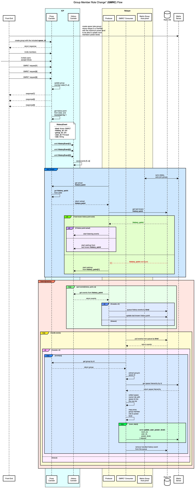

# Relayer

Relayer service for the Catalyze platform, which is responsible for relaying messages between the
[Internet Computer Protocol (ICP)](https://internetcomputer.org/) and the Catalyze platform.
Particular information about which role the relayer service plays can be found in the
[History Canister RFC](https://github.com/Catalyze-Software/history/blob/main/rfc.md).

## Overview

In the current state relayer service is responsible for the querying the history canister for the
events and relaying them to the [Matrix server](https://spec.matrix.org/). The relayer service is
written in Rust and uses:

- [`ic-agent`](https://docs.rs/ic-agent/latest/ic_agent/) library for interacting with the Internet
Computer.
- [`matrix_sdk`](https://docs.rs/matrix-sdk/latest/matrix_sdk) library for making requests to the
  Matrix server.
- [`redis`](https://docs.rs/redis/latest/redis/) library for caching the history canister events and
  the last processed event (history point).

The relayer service is designed to be run as a standalone service with the usage of the
multithreading benefits and can be deployed using Docker. The current design of the relayer service
includes the following components:

- **Main thread** - responsible for the main logic of the relayer service, as initialize the third-party
  clients, start the worker threads, and handle the shutdown signal.
- **Producer** - responsible for querying the history canister for the events and sending them to the
  Redis queue, splitting the events by kind to the different queues.
- **Consumer(s)** - responsible for consuming the events from the Redis queue and processing them.
  In the current state, the relayer service has only one consumer, which is responsible for relaying
  the "Group Member Role Change" events to the Matrix server, but it can be extended to have multiple
  consumers for different events, which can be processed in parallel. The current architecture of the
  relayer service allows to easily extend the number of consumers and the processing logic.

## Flows

There is described the main flows of the relayer service, each flow will be described in the separate.

### Group Member Role Change

The flow is responsible for relaying the "Group Member Role Change" events from the history canister
to the Matrix server. The flow includes the following steps:

1. **Producer** queries the history canister for the events and sends them to the Redis queue.
2. **Consumer** consumes the events from the Redis queue and processes them.
3. **Consumer** checks if the event is the "Group Member Role Change" event.
4. **Consumer** gets the actual `history_point` from the proxy canister.
5. **Consumer** relays the event to the Matrix server.
6. **Consumer** updates the removes event from the queue.
7. **Consumer** repeats the steps 2-6.

The flow is designed to be run in the loop and can be stopped by the shutdown signal.

There is visualized flow as a sequence diagram:



## Changelog

For the changelog, see [CHANGELOG.md](./CHANGELOG.md).

## Development

To clone this repository, run the following command:

```shell
git clone git@github.com:Catalyze-Software/relayer.git
git submodule update --init --recursive
```

`git submodule update --init --recursive` is necessary to clone the submodules in this repository.

Git Submodules are:

- [`proxy`](https://github.com/Catalyze-Software/proxy) - the proxy canister source code, which is
  used for encoding\decoding the ICP messages (history canister events). In the future, those types
  will be moved to the separate crate and will be used by the relayer service and the proxy canister.

## Configuration

The relayer service is configured using [`config.toml`](./config.toml) file or environment variables.
Environment variable should be prefixed with `RELAYER_` and should be in uppercase. For example, the
`config.toml` file:

```toml
log_filter="info,reqwest=info,rustls=info,hyper_util=info,hyper=info"
proxy_id="24swh-4iaaa-aaaap-ahevq-cai"
history_id="qejor-xqaaa-aaaap-ahjaa-cai"
matrix_url="https://matrix.staging.catalyze.chat"
redis_url="redis://localhost:6379"
skip_catchup=false
```

The environment variables:

```shell
RELAYER_LOG_FILTER="info,reqwest=info,rustls=info,hyper_util=info,hyper=info"
RELAYER_PROXY_ID="24swh-4iaaa-aaaap-ahevq-cai"
RELAYER_HISTORY_ID="qejor-xqaaa-aaaap-ahjaa-cai"
RELAYER_MATRIX_URL="https://matrix.staging.catalyze.chat"
RELAYER_REDIS_URL="redis://localhost:6379"
RELAYER_SKIP_CATCHUP=false
```

Where:

- `log_filter` or `RELAYER_LOG_FILTER` is the log filter for the relayer service. The log filter is
  a comma-separated list of log levels for different modules. The log levels are `trace`, `debug`,
  `info`, `warn`, and `error`. More details about the log filter can be found in the
  [[tracing_subscriber]](https://docs.rs/tracing-subscriber/latest/tracing_subscriber/filter/struct.EnvFilter.html)
   documentation.
- `proxy_id` or `RELAYER_PROXY_ID` is the proxy canister ID, which is used for querying the proxy
  canister (mostly for getting actual `history_point`).
- `history_id` or `RELAYER_HISTORY_ID` is the history canister ID, which is used for querying the
  history canister events.
- `matrix_url` or `RELAYER_MATRIX_URL` is the Matrix server URL, which is used for sending the
  messages to the Matrix server.
- `redis_url` or `RELAYER_REDIS_URL` is the Redis URL, which is used for queuing the history events.
- `skip_catchup` or `RELAYER_SKIP_CATCHUP` is the flag to skip the catchup process. The catchup
  process is responsible for catching up the missed events from the history canister. The catchup
  process is enabled by default, but it can be disabled by setting the `skip_catchup` flag to `true`.
  Usefull for the testing purposes.

## Building

To build the relayer service, run the following command:

```shell
cargo build --release
```

The command will build the relayer service in the release mode and will create the binary in the
`./target/release/relayer` directory.

### Docker

To build the Docker image, run the following command:

```shell
docker build . -t relayer:latest
```

or use existing script:

```shell
sh scripts/build.sh
```

## Running

To run the relayer service, run the following command:

```shell
cargo run --bin relayer
```

The command will run the relayer service. But you still need to run redis server somewhere, this
will be enough to run it with the docker-compose:

```yaml
version: "3.8"

services:
  redis:
    image: redis:7.2
    ports:
      - "6379:6379"
    volumes:
      - redis-data:/data
    command: ["redis-server", "--appendonly", "yes"] # save data to disk

volumes:
  redis-data:
```

### Docker-Compose

To run the Docker container, create docker-compose.yml file:

```yaml
version: "3.8"

services:
  relayer:
    image: relayer:latest
    restart: always
    volumes:
      - ./config.toml:/config.toml

  redis:
    image: redis:7.2
    volumes:
      - redis-data:/data
    command: ["redis-server", "--appendonly", "yes"] # save data to disk

volumes:
  redis-data:
```

You can use own image or use the existing one. check the [relayer's registry] for the latest version.

**To be able to pull the image from the registry, you need to login to the GitHub registry** (because
the repository is private), check [Authenticating with a personal access token] section in
the GitHub documentation.

Then run the following command:

```shell
docker-compose up -d
```

The command will run the relayer service and the Redis server. To check the logs, run the following
command:

```shell
docker-compose logs -f relayer
```

## License

[GPL-2.0 License](./LICENSE) © [Catalyze Software](https://catalyze.one/)

[relayer's registry]: https://github.com/Catalyze-Software/relayer/pkgs/container/relayer
[Authenticating with a personal access token]: https://docs.github.com/en/packages/working-with-a-github-packages-registry/working-with-the-container-registry#authenticating-with-a-personal-access-token-classic
